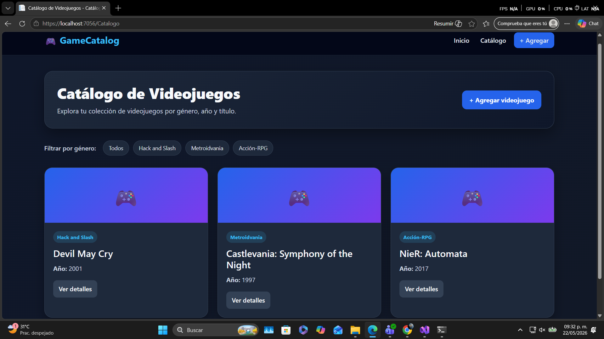
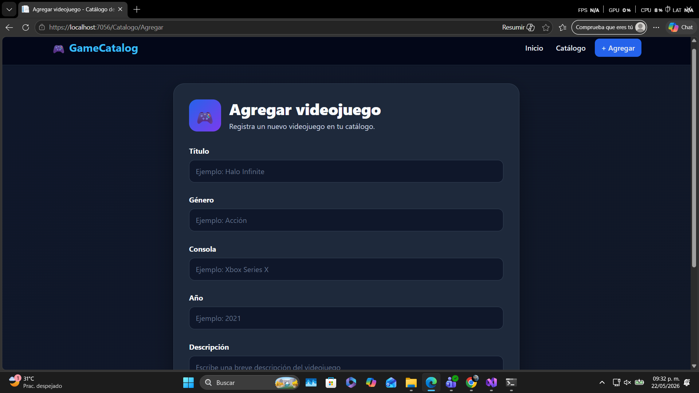

# Catálogo de Videojuegos

## Descripción del proyecto

Catálogo de Videojuegos es una aplicación web desarrollada en .NET con ASP.NET Core MVC.  
El proyecto permite administrar un catálogo básico de videojuegos, mostrando una lista de juegos registrados, sus detalles y un formulario para agregar nuevos videojuegos.

Cada videojuego contiene información como título, género, consola, año y descripción.

El objetivo del proyecto es practicar la creación de aplicaciones web con arquitectura por capas, separando la lógica del dominio, la aplicación, la infraestructura y la presentación.

## Tecnologías usadas

- C#
- .NET
- ASP.NET Core MVC
- Razor Views
- HTML
- CSS
- Bootstrap
- JSON
- Git
- GitHub
- Visual Studio

## Estructura del proyecto

El proyecto está organizado en diferentes capas:

```text
CatalogoApp
│
├── CatalogoApp.Aplication
│   └── Services
│
├── CatalogoApp.Domain
│   ├── Interfaces
│   └── Models
│
├── CatalogoApp.Infrastructure
│   └── Repositories
│
├── CatalogoApp.Presentation
│   ├── Controllers
│   ├── data
│   ├── Views
│   ├── wwwroot
│   └── Program.cs
│
├── CatalogoApp.sln
├── .gitignore
└── README.md
```
## Capturas de pantalla de la aplicación

A continuación se muestran capturas de pantalla de la aplicación funcionando.

### 1. Catálogo de videojuegos



### 2. Formulario para agregar videojuego



### 3. Catalgo con juegos agrgados


## Cláusula de uso de Inteligencia Artificial

Durante el desarrollo de este proyecto se utilizó Inteligencia Artificial como herramienta de apoyo para organizar la documentación, resolver dudas técnicas y proponer mejoras en la interfaz visual.
